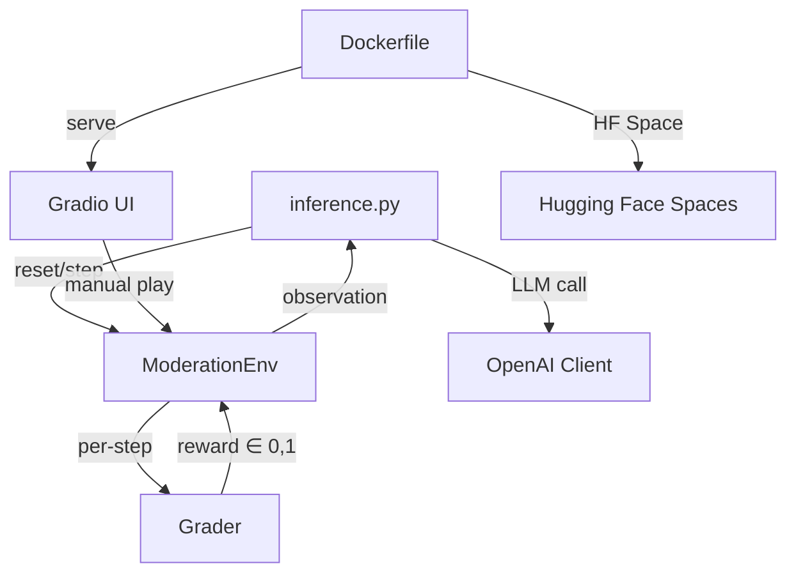

# Content Moderation OpenEnv Environment – Implementation Plan

Build a complete OpenEnv-compliant content moderation RL environment for the Meta PyTorch OpenEnv Hackathon x Scaler School of Technology (Round 1).

## User Review Required

> [!IMPORTANT]
> **Deadline**: 8 April 23:59 IST. This plan covers the full end-to-end implementation (environment, graders, inference, Docker, HF Space).

> [!WARNING]
> **HF_TOKEN Required**: You will need a Hugging Face token set as an environment variable for `inference.py` to call the LLM API. Please confirm you have one ready.

> [!IMPORTANT]
> **Team/Author Info**: The `openenv.yaml` and `README.md` will need your team name and author names. Please confirm these.

---

## Architecture Overview



## Proposed Changes

### Component 1: Project Scaffold & Data

#### [NEW] [pyproject.toml](file:///d:/Documents/College_purpose/Hackathon/Scaler/pyproject.toml)
- Package metadata, dependencies: `openenv-core`, `pydantic`, `openai`, `gradio`, `uvicorn`, `fastapi`

#### [NEW] [openenv.yaml](file:///d:/Documents/College_purpose/Hackathon/Scaler/openenv.yaml)
- OpenEnv manifest: `spec_version: 1`, name `content_moderation_env`, type `space`, runtime `fastapi`, app `server.app:app`, port `7860`

#### [NEW] [data/datasets.py](file:///d:/Documents/College_purpose/Hackathon/Scaler/data/datasets.py)
- Synthetic dataset embedded in Python (no external files needed)
- **Easy**: 10 posts with obvious labels (spam, explicit abuse, benign)
- **Medium**: 10 posts with nuanced content + policy tags
- **Hard**: 3 threads of 5-8 messages each requiring context-aware moderation
- Each data point: `content`, `metadata`, `thread_context`, `true_decision`, `true_tags`, `severity`

---

### Component 2: Pydantic Models

#### [NEW] [content_moderation_env/models.py](file:///d:/Documents/College_purpose/Hackathon/Scaler/content_moderation_env/models.py)
- `ModerationAction(Action)` – extends OpenEnv `Action` base, with `decision` (ALLOW/WARN/SOFT_BLOCK/HARD_BLOCK/ESCALATE), `policy_tags`, `explanation`
- `ModerationObservation(Observation)` – extends OpenEnv `Observation` base, with `content`, `metadata`, `thread_context`, `task_id`, `step_index`
- `ModerationState(State)` – extends OpenEnv `State` base, with `task_id`, `total_reward`, `catastrophic_error`

---

### Component 3: Environment Implementation

#### [NEW] [content_moderation_env/server/moderation_environment.py](file:///d:/Documents/College_purpose/Hackathon/Scaler/content_moderation_env/server/moderation_environment.py)
- `ModerationEnvironment(Environment)` extends the OpenEnv `Environment` base class
- `reset(task=None)` → selects task, loads dataset, returns first observation
- `step(action)` → calls grader, computes reward, advances to next post, returns observation
- `state` property → returns `ModerationState`
- Handles edge cases: invalid actions get 0.0 reward, no crashes

---

### Component 4: Graders (Deterministic)

#### [NEW] [content_moderation_env/graders.py](file:///d:/Documents/College_purpose/Hackathon/Scaler/content_moderation_env/graders.py)

**Easy Grader**:
- `1.0` if decision matches ground truth
- `0.5` for conservative-but-safe (e.g., SOFT_BLOCK where gold is WARN)
- `0.0` for under-moderation

**Medium Grader**:
- `decision_score`: 0.7 correct, 0.4 conservative, 0.0 under-moderation
- `tag_score`: F1 between predicted and true policy tags
- `reward = clip(0.6 * decision_score + 0.4 * tag_score, 0.0, 1.0)`

**Hard Grader**:
- Starts from medium grader score
- Severe under-moderation on high-severity: −0.7 penalty (capped at 0.0)
- Over-moderation on benign: −0.2 penalty
- Episode-level monotonicity penalty if all decisions are the same

---

### Component 5: FastAPI Server & App

#### [NEW] [content_moderation_env/server/app.py](file:///d:/Documents/College_purpose/Hackathon/Scaler/content_moderation_env/server/app.py)
- Creates FastAPI app using `create_app()` from `openenv.core.env_server.http_server`
- Passes `ModerationEnvironment`, `ModerationAction`, `ModerationObservation`

#### [NEW] [content_moderation_env/server/__init__.py](file:///d:/Documents/College_purpose/Hackathon/Scaler/content_moderation_env/server/__init__.py)

#### [NEW] [content_moderation_env/__init__.py](file:///d:/Documents/College_purpose/Hackathon/Scaler/content_moderation_env/__init__.py)
- Exports `ModerationAction`, `ModerationObservation`, `ModerationState`, `ModerationEnv`

#### [NEW] [content_moderation_env/client.py](file:///d:/Documents/College_purpose/Hackathon/Scaler/content_moderation_env/client.py)
- `ModerationEnv(EnvClient)` with typed `_step_payload`, `_parse_result`, `_parse_state`

---

### Component 6: Inference Script

#### [NEW] [inference.py](file:///d:/Documents/College_purpose/Hackathon/Scaler/inference.py)
- Located at **project root** (required by hackathon)
- Reads `API_BASE_URL`, `MODEL_NAME`, `HF_TOKEN` from env vars
- Uses `OpenAI` client: `OpenAI(base_url=API_BASE_URL, api_key=HF_TOKEN)`
- Runs all 3 tasks (`easy`, `medium`, `hard`)
- Emits **exact** `[START]`, `[STEP]`, `[END]` log format
- Includes `build_prompt_from_observation()` and `parse_action_from_completion()` helpers
- Success threshold: average reward ≥ 0.3

---

### Component 7: Gradio UI (HF Space)

#### [NEW] [app.py](file:///d:/Documents/College_purpose/Hackathon/Scaler/app.py)
- Gradio interface wrapping the environment for interactive testing
- Task selector (easy/medium/hard), content display, action controls
- Per-step reward display and episode summary
- Runs on port 7860 (HF Spaces default)

---

### Component 8: Docker & Deployment

#### [NEW] [Dockerfile](file:///d:/Documents/College_purpose/Hackathon/Scaler/Dockerfile)
- Base: `python:3.11-slim`
- Installs only: `pydantic`, `openai`, `gradio`, `openenv-core`, `fastapi`, `uvicorn`
- Copies project code, exposes port 7860
- `CMD` runs the Gradio app
- Fits within **2 vCPU / 8 GB RAM**

#### [NEW] [requirements.txt](file:///d:/Documents/College_purpose/Hackathon/Scaler/requirements.txt)

#### [NEW] [.gitignore](file:///d:/Documents/College_purpose/Hackathon/Scaler/.gitignore)

---

### Component 9: README

#### [NEW] [README.md](file:///d:/Documents/College_purpose/Hackathon/Scaler/README.md)
- Environment overview, observation/action space tables
- Task descriptions (easy, medium, hard)
- Grading logic explanation
- Quickstart and Docker instructions
- Baseline scores

---

## File Tree (Final)

```
d:\Documents\College_purpose\Hackathon\Scaler\
├── openenv.yaml
├── pyproject.toml
├── requirements.txt
├── Dockerfile
├── .gitignore
├── README.md
├── inference.py                          # Root-level (hackathon requirement)
├── app.py                                # Gradio UI entry point
├── data/
│   ├── __init__.py
│   └── datasets.py                       # Synthetic data (embedded)
└── content_moderation_env/
    ├── __init__.py
    ├── models.py                         # Pydantic: Action, Observation, State
    ├── graders.py                        # Deterministic grading logic
    ├── client.py                         # EnvClient subclass
    └── server/
        ├── __init__.py
        ├── moderation_environment.py     # Environment(Environment)
        └── app.py                        # FastAPI server
```

## Open Questions

> [!IMPORTANT]
> 1. **Team Name / Authors**: What should I put in `openenv.yaml` and `README.md` for author/team info?
> 2. **HF Token**: Do you have an `HF_TOKEN` ready for testing `inference.py`?
> 3. **HF Space Name**: What Hugging Face Space name/org should be used for deployment?

## Verification Plan

### Automated Tests
1. **Unit test graders**: Run each grader with known inputs and verify deterministic outputs
2. **Environment smoke test**: `reset()` → `step()` loop for all 3 tasks, verify rewards in `[0.0, 1.0]`
3. **Inference log format**: Run `inference.py` (with mock LLM) and verify `[START]`/`[STEP]`/`[END]` format matches spec exactly
4. **OpenEnv validate**: Run `openenv validate` on the project

### Manual Verification
1. Run `docker build` and `docker run` locally to verify container works within resource constraints
2. Test Gradio UI manually in browser
3. Verify HF Space is in `Running` state before submission
